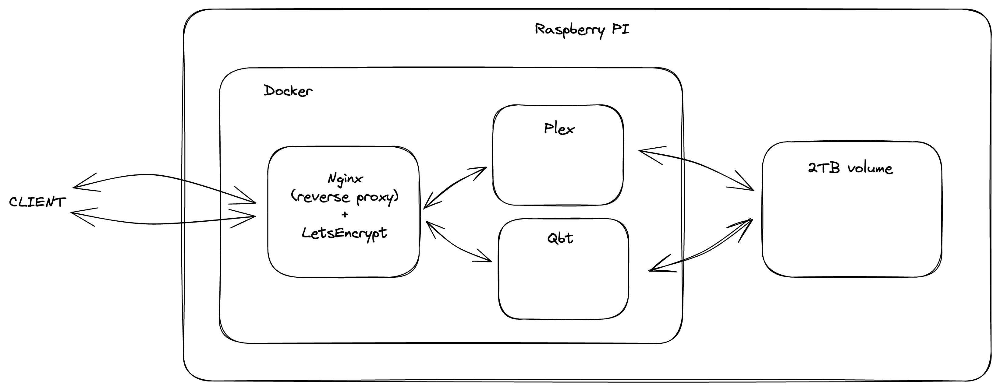

# Raspberry Pi Media Server

## Architecture



## Installation

Create `.env` file:

```
QBT_CONFIG_PATH=***
QBT_DOWNLOADS_PATH=***

PLEX_CONFIG_PATH=***
PLEX_SERIES_PATH=***
PLEX_MOVIES_PATH=***

NGINX_CONF_PATH=***

CERTBOT_WWW_PATH=***
CERTBOT_CONF_PATH=***
```

### Certificate

https://mindsers.blog/post/https-using-nginx-certbot-docker/

Change **domain.com** with you domain from now on.

Create file `domain.com.conf` with this content:

```
server {
    listen 80;
    listen [::]:80;

    server_name domain.com www.domain.com;
    server_tokens off;

    location /.well-known/acme-challenge/ {
        root /var/www/certbot;
    }

    location / {
        return 301 https://domain.com$request_uri;
    }
}
```

Now set up nginx server:

```
docker compose up -d nginx
```

Next, run command to issue the certificate for your domain:

```
docker compose run --rm  certbot certonly --webroot --webroot-path /var/www/certbot/ -d domain.com
```

Update the config file the following:

```
server {
    listen 80;
    listen [::]:80;

    server_name domain.com www.domain.com;
    server_tokens off;

    location /.well-known/acme-challenge/ {
        root /var/www/certbot;
    }

    location / {
        return 301 https://domain.com$request_uri;
    }
}

server {
    listen 443 default_server ssl http2;
    listen [::]:443 ssl http2;

    server_name domain.com;

    ssl_certificate /etc/nginx/ssl/live/domain.com/fullchain.pem;
    ssl_certificate_key /etc/nginx/ssl/live/domain.com/privkey.pem;
    
    location / {
    	# ...
    }
}
```

And reload the nginx server:

```
docker compose restart nginx
```